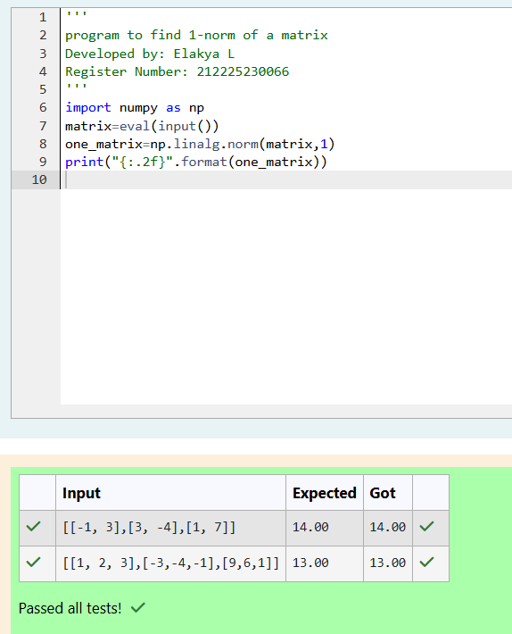
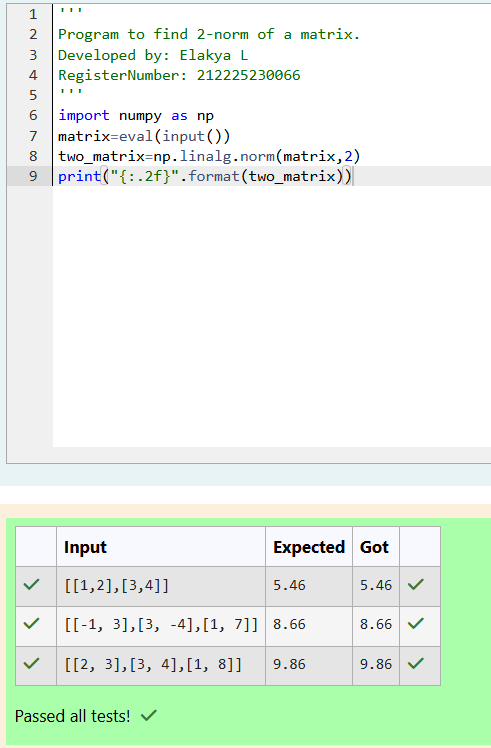
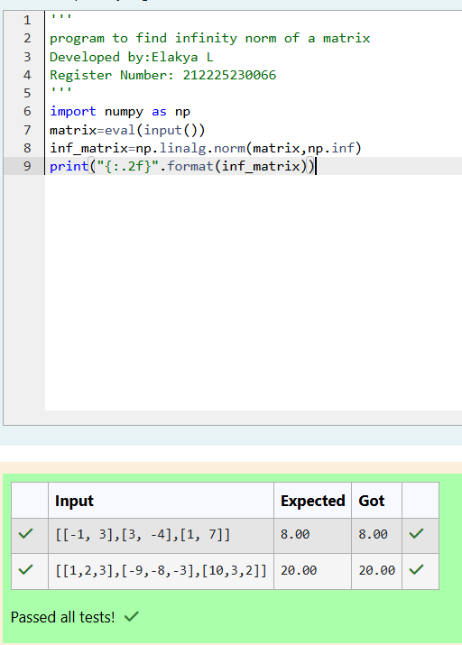

# Norm of a matrix
## Aim
To write a program to find the 1-norm, 2-norm and infinity norm of the matrix and display the result in two decimal places.
## Equipment’s required:
1.	Hardware – PCs
2.	Anaconda – Python 3.7 Installation / Moodle-Code Runner
## Algorithm:
	1. Get the input matrix using np.array()   
    2. Find the 1-norm,2-norm,infinity norm of the matrix using np.linalg.norm()
	3. Print the norm of the matrix in two decimal places.
## Program:
# Register No: 212225230066
# Developed By: Elakya L
# 1-Norm of a Matrix
```
import numpy as np 
matrix=eval(input())
one_matrix=np.linalg.norm(matrix,1)
print("{:.2f}".format(one_matrix))

```
# 2-Norm of a Matrix
```
import numpy as np
matrix=eval(input())
two_matrix=np.linalg.norm(matrix,2)
print("{:.2f}".format(two_matrix))
```


# Infinity Norm of a Matrix

```
import numpy as np 
matrix=eval(input())
inf_matrix=np.linalg.norm(matrix,np.inf)
print("{:.2f}".format(inf_matrix))
```
## Output:
### 1-Norm of a Matrix




### 2-Norm of a Matrix





### Infinity Norm of a Matrix




## Result
Thus the program for 1-norm, 2-norm and Infinity norm of a matrix are written and verified.
